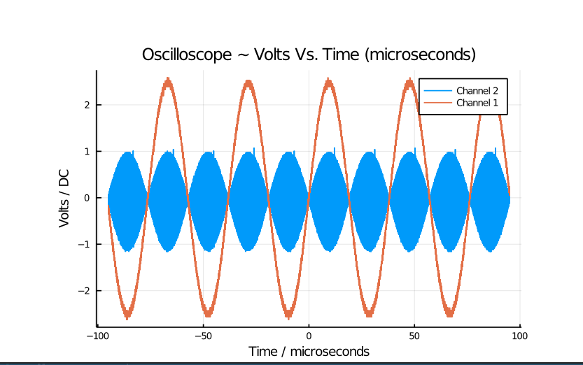

# TcpInstruments

[](https://www.repostatus.org/#wip)
[](https://travis-ci.com/github/Orchard-Ultrasound-Innovation/TcpInstruments.jl)
[](LICENSE)
[](https://coveralls.io/github/Orchard-Ultrasound-Innovation/TcpInstruments.jl?branch=master)
[](https://orchard-ultrasound-innovation.github.io/TcpInstruments.jl/dev/)
[](https://github.com/invenia/BlueStyle)

Control common lab equipment via SCPI over Ethernet and specifically not be dependent on the NIVISA library that other similar packages often have depended on.

This package is based on code from [GenericInstruments.jl](https://ci.appveyor.com/project/iuliancioarca/GenericInstruments-jl)
which was again based on [Instruments.jl](https://github.com/BBN-Q/Instruments.jl). 

SCPI is supported on almost all modern pieces of lab equipment but this code has been tested on the following devices:
- [X] Oscilloscope Keysight DSOX4034A
- [X] Oscilloscope Keysight DSOX4024A
- [X] Multimeter Keysight DMM34465A
- [X] Signal generator Keysight 33612A
- [X] Power supply Agilent E36312A
- [X] HV power supply SRS PS310 via Prologix GPIB to Ethernet adaptor
- [X] Power supply Versatile Power 100-10 XR
- [X] Impedance analyser Agilent 4294A
- [ ] Impedance analyser Agilent 4395A (with 43961A imp. probe)

For more information on every type of instrument as well as
their available functions and how they work:

## Installation
TcpInstruments can be installed using the Julia package manager. From the Julia REPL, type ] to enter the Pkg REPL mode and run

```julia
pkg> add TcpInstruments
julia> using TcpInstruments
julia> ?
help> Instrument
```

To make things easier you can also use a config file.
This will preset the ip addresses of the instruments so you don't need to remember them.
You can write your own or ask your lab advisor for the lab's config file.

To get Orchard's config or update your config to Orchard's current latest version use:
```julia
julia> TcpInstruments.create_config()
```

Should you ever need to change anything in your config you can always use:
```julia
julia> TcpInstruments.edit_config()
```

# Using this library
To use any device you must first initialize it.

handler = initialize({name-of-device}, "{ip-address}")

The ip address can also have a port. If no port is specified, 
5025 is used by default.

Thus `"10.1.30.36"` defaults to `"10.1.30.36:5025"`

To see the list of commands for this device, look up this device
in the documentation or in the repl: `help>{name-of-device}`

## Util Commands
To see a list of all available ip addresses and devices:
```julia
julia> scan_network()
3-element Vector{Pair{String, B} where B}:
 "10.1.30.28:????" => ""
 "10.1.30.34:5025" => "Keysight Technologies,E36312A,MY59002391,2.1.0-1.0.4-1.12"
 "10.1.30.38:5025" => "Keysight Technologies,34465A,MY59008389,A.03.01-03.15-03.01-00.52-03-02"
```

## Units
This package uses Unitful. In order to control certain devices
it is required to run:
```julia
using Unitful
```

Commands such as:
```julia
set_voltage_offset(instr, 0)
```
will not work you must specify the units:
```julia
set_voltage_offset(instr, 0u"V")
```


# Examples
## Waveform Generator
###  Creating a Sin Wave Example:
```julia
wave = initialize(Keysight33612A, "10.1.30.36")
set_mode_cw(wave) # Set to continuous waveform mode
set_function(wave, "SIN")
set_frequency(wave, 1000u"Hz")
set_amplitude(wave, 0.1u"V")
set_voltage_offset(wave, 0u"V")
enable_output(wave) # Starts wave

```
## GPIB Power Supply (SRSPS310) used with Prologix Controller
### Initialize Prologix Channel
To a initialize a device that is connected with a prologix
controller you must specify what prologix channel the device
is on. At this moment the prologix adapter is the only supported
GPIB to Ethernet adapter.
```julia
p = initialize(SRSPS310, "10.1.30.37:1234"; GPIB_ID=2)
```
If you don't know the channel you can figure it out and configure
it manually:
```julia
julia> using TcpInstruments
julia> p = initialize(SRSPS310, "10.1.30.37:1234")
julia> scan_prologix(p)
2 => "PS310"
julia> set_prologix(p, 2)
julia> get_prologix(p)
2
```
### Using SRSPS310 Power Supply
```julia
p = initialize(SRSPS310, "10.1.30.37:1234"; GPIB_ID=2)
set_voltage_limit(p, 1250u"V")
set_voltage(p, 1250u"V")
set_current_limit(p, 0.021u"A") # equivalent to set_current_limit(p, 21u"mA")
enable_output(p)
```

## Autoinitialize
Additionally you can create a `.tcp_instruments.yml` file. You 
can save the ip address of all your devices 
in one easy-to-find place so they don't have to be hardcoded in scripts.

Format of `.tcp_instruments.yml` file:
```julia
{name-of-device}:
    address: "{ip-address}"

# GPIB Device connected with a prologix controller
{name-of-device}:
    gpib: {channel-number}
    address: "{ip-address}"
```

Let's create a new `.tcp_instruments.yml` file or ensure the two previous
devices are found in our `.tcp_instruments.yml` file
```yaml
Keysight33612A:
    address: "10.1.30.36"
    alias: "OleBigWave"
SRSPS310:
    gpib: 2
    address: "10.1.30.37:1234"
```

Recompile new config
```julia
julia --project=.
julia> using TcpInstruments
```

The `.tcp_instruments.yml` file must be in the current directory of our project. If you have multiple scripts in different directories you can
can also place the config file in your home directory: `~/.tcp_instruments.yml`.

Each project will first look for a config in the current directory and if none is found it will look in the home directory.

The two devices from above can now be initialized as follows:
```julia
wave = initialize(Keysight33612A)
p = initialize(SRSPS310)
```

__Cool tip__: Since we specified an alias for the waveform generator we can initialize it this way as well:
```julia
wave = initialize(OleBigWave)
```
(No dashes, spaces or other special characters in alias names, treat them like variables because they are)
## Power Supplies
# VersatilePower
```julia
# Initialize automatically puts this power supply in remote mode
pwr = initialize(VersatilePower)

set_voltage(pwr, 20u"V")
set_current_limit(pwr, 4u"A")
enable_output(pwr)

# Closes connection as with other devices but also puts this
# device back into local mode
terminate(pwr)


```
# AgilentE36312A
```julia
pwr = initialize(AgilentE36312A)

set_channel(pwr, 1)
set_current_limit(pwr, 1)
set_voltage(pwr, 2u"V")
enable_output(pwr) # Enables output on channel 1

set_channel(pwr, 2)
set_voltage(pwr, 10u"V")
enable_output(pwr) # Enables output on channel 2

set_channel(pwr, 3)
set_voltage(pwr, 10u"V")

set_voltage(pwr, 0u"V"; chan=1) # Changes voltage of channel 1

get_voltage(pwr) # Get voltage channel 3
get_voltage(pwr; chan=2)
get_voltage(pwr; chan=1)

enable_output(pwr) # Enables output on channel 3
```

## Scope
### AgilentDSOX4034A
```julia
scope = initialize(AgilentDSOX4034A)

# Turn on Low Pass Filter 25MHz
lpf_on(scope)

# See that low pass filter is on
get_lpf_state(scope)

# Turn Off Low Pass Filter 25MHz
lpf_off(scope)

# See that low pass filter is off
get_lpf_state(scope)


set_impedance_1Mohm(scope)
@info get_impedance(scope)

set_impedance_50ohm(scope)
@info get_impedance(scope)

# Get data from channel 1
data = get_data(scope, 1)

# Get data from channel 1, 2, & 4
# Returns 3 element array of data from each channel
multi_data = get_data(scope, [1,2, 4])


using Plots

plot(data)

# Plots channel 1
plot(multi_data[1])

# Plots channel 2
plot(multi_data[2])

# Plots channel 4
plot(multi_data[3])

# Saves data to a file
save(multi_data)
```

Additionally you can grab data from all open channels
(Let's say only channels 1 & 2 are activated for now)
```
scope = initialize(AgilentDSOX4034A)
data = get_data(scope)    
```
Since the only activated channels are now only 1 & 2 this returns an array of waves (equivalent to `get_data(scope, [1,2]))

You can also plot multiple waves at once:
```
plot(data)
```



# Multiple devices
Lets say you want to use a waveform generator, power supply
and oscilloscope all at once.
```julia
using TcpInstruments
using Plots; gr()

scope = initialize(AgilentDSOX4034A)
pwr = initialize(VersatilePower)
wave = initialize(Keysight33612A)

set_mode_cw(wave)
set_function(wave, "SIN")
set_frequency(wave, 1000u"Hz")
set_amplitude(wave, 0.1u"A")
set_voltage_offset(wave, 0u"V")
enable_output(wave)

set_voltage(pwr, 20u"V")
set_current_limit(pwr, 4u"A")
enable_output(pwr)

chan1, chan2 = get_data(scope, [1,2])
plot(chan1)
```

For more examples of how to use different devices look in the
test folder
